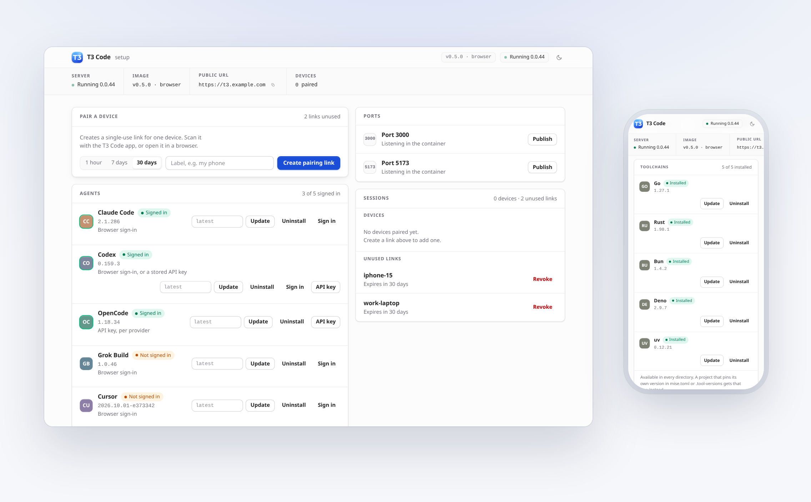
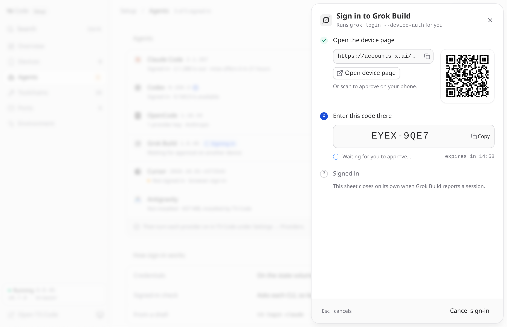
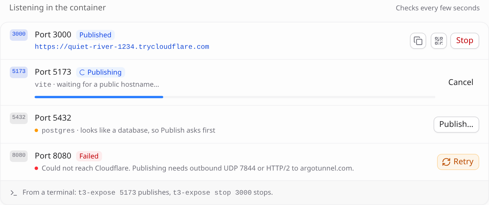
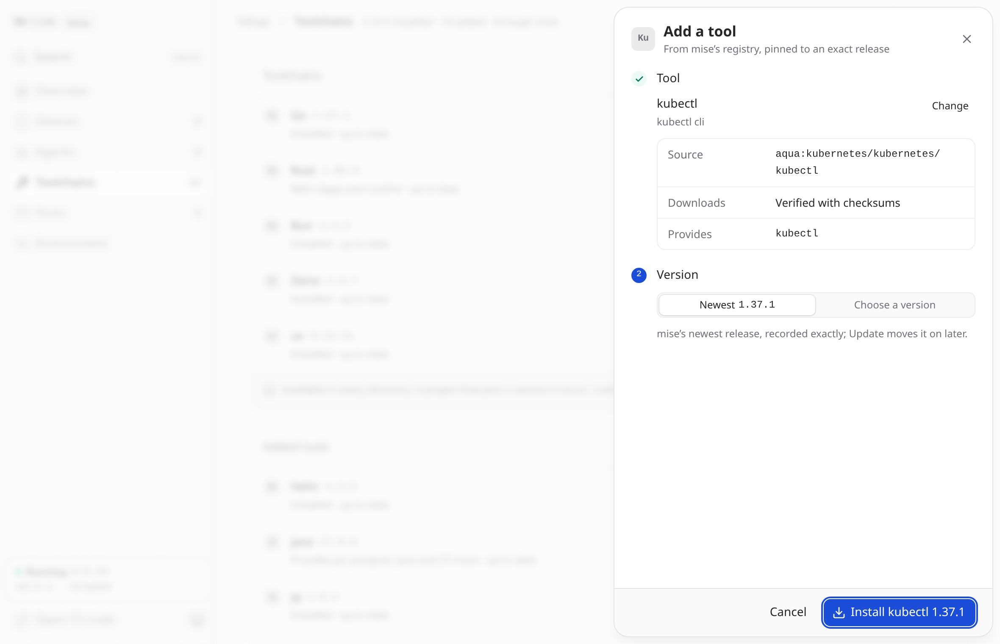

<div align="center">


<p>
  <a href="https://github.com/dizys/t3code-docker/actions/workflows/build.yml"></a>
  <a href="https://github.com/dizys/t3code-docker/pkgs/container/t3code-docker"></a>
  <a href="https://github.com/dizys/t3code-docker/releases"></a>
  
  <a href="LICENSE"></a>
</p>

<p><strong>Run <a href="https://github.com/pingdotgg/t3code">T3 Code</a> as a headless server in a container,<br>
with coding agents and language toolchains installed on first start.</strong></p>

<picture>
  <source media="(prefers-color-scheme: dark)" srcset="docs/media/setup-dark.png">
  
</picture>

</div>

T3 Code is a control surface for coding agents. The server runs the agents,
git and your terminals; the desktop, web and phone apps are clients that
connect to it over a WebSocket. Run the server on a machine you can reach, and
a phone is enough to use it.

This image packages the server with what it needs: the agent CLIs and language
toolchains, installed onto your volume on first start; a headless browser the
agents can use; and a setup page for pairing devices, signing agents in and
keeping everything up to date, without a shell in the container.

> [!NOTE]
> T3 Code is alpha software and changes quickly, and so does this image.

## Highlights

- **Pair a phone from a web page.** The setup page creates a pairing link and
  QR code. No terminal needed.
- **Reachable from T3 Code's settings.** Once a browser is paired, Settings has
  a **Setup** entry that opens the setup page in a dialog, signed in with your
  T3 Code session.
- **Sign agents in from the browser.** The setup page runs each agent's own
  sign-in flow and shows you the link, QR code or code to enter. Credentials are
  stored on the state volume and survive a recreate.
- **Agents and toolchains live on the volume.** Claude Code, Codex and OpenCode,
  plus Go, Rust, Bun, Deno and uv, install in the background on first start, at
  exact versions. Grok, Cursor and Antigravity install with one click. The image
  stays small, pulling a new one doesn't reset them, and updating is a button.
  Node, Python, clang, ffmpeg, ImageMagick and psql are in the image, and any
  other tool mise can install (kubectl, Java, Terraform and about a thousand
  more) can be added from the setup page.
- **A browser for the agents.** Headless Chromium with Playwright and Chrome
  DevTools MCP servers, registered with Claude Code, Codex and OpenCode.
- **Publish a dev server.** Publish a port from the setup page or with
  `t3-expose 3000` to get a public https URL and a QR code. No DNS, certificates
  or port forwarding.
- **Tested on both architectures.** `linux/amd64` and `linux/arm64` are each
  built and tested on a native runner before anything is published.

## Contents

- [Quickstart](#quickstart)
- [What's in the box](#whats-in-the-box)
- [First run: the setup page](#first-run-the-setup-page)
- [Connecting a phone](#connecting-a-phone)
- [Publishing a port](#publishing-a-port)
- [Giving agents a browser](#giving-agents-a-browser)
- [Agents](#agents)
- [Toolchains](#toolchains)
- [How long things last](#how-long-things-last)
- [Configuration](#configuration)
- [Building](#building)
- [Security](#security)
- [Troubleshooting](#troubleshooting)

## Quickstart

```bash
git clone https://github.com/dizys/t3code-docker
cd t3code-docker
cp .env.example .env      # then edit PUID/PGID and T3_WORKSPACE_HOST
docker compose up -d --build
```

Prebuilt images are published to `ghcr.io/dizys/t3code-docker`:

| Tags | Image |
| --- | --- |
| `latest`, `browser`, `full` | Everything, including the headless browser |
| `core`, `slim` | The same without the browser |
| `0.7.0`, `0.7`, and `0.7.0-core`, `0.7-core` | A specific release |

Each tag is a multi-arch manifest for `linux/amd64` and `linux/arm64`, so
`docker pull` gets the right one on an ARM server. To run a published image
instead of building, set `T3_IMAGE` in `.env` and drop `--build`.

On first start, the container installs the default agents and toolchains onto
the `/home/t3` volume in the background. This takes a few minutes, and the
setup page shows the progress. In the meantime, open the setup page on port
**3774**, enter the setup key, and press **Create pairing link**. Scan the
QR code with the T3 Code app, or open the link in a browser.

Then sign each agent in on the setup page's **Agents** page, and turn its
provider on in T3 Code under **Settings → Providers**. None of this needs a
shell in the container. If you prefer one:

```bash
docker compose exec t3code t3-doctor             # what is installed, signed in and healthy
docker compose exec t3code t3-harness list       # agents and their exact versions
docker compose exec -it t3code t3-login claude   # sign an agent in from a shell
```

## What's in the box

| | `browser` (`latest`) | `core` |
| --- | :---: | :---: |
| T3 Code server and web app | ✅ | ✅ |
| git, git-lfs, gh, ssh, Node, Python | ✅ | ✅ |
| clang/CMake/GDB, ffmpeg, ImageMagick, psql, redis-cli | ✅ | ✅ |
| Claude Code, Codex, OpenCode | first start | first start |
| Grok, Cursor, Antigravity | one click | one click |
| Go, Rust, Bun, Deno, uv | first start | first start |
| mise, for per-project versions | ✅ | ✅ |
| Headless Chromium and browser MCP servers | ✅ | — |
| cloudflared, for publishing a port | ✅ | ✅ |
| Image size, unpacked (download) | ~2.5 GB (~1.0 GB) | ~1.9 GB (~0.7 GB) |

"First start" means the container installs it onto the `/home/t3` volume in the
background the first time it runs, and not again. That's about 2 GB that stays
on the volume you already keep instead of being part of every pull. "One click"
means the setup page installs it when you ask. `T3_PREINSTALL` changes what the
first start installs: `all` adds Grok and Cursor, and `agents`, `toolchains`, a
list like `claude,codex,go`, or `none` also work. Anything left out can be
installed from the setup page later.

Neither image contains credentials or model access. You bring your own
subscriptions or API keys and sign the agents in yourself.

## First run: the setup page

The container runs a setup page on port **3774**, next to T3 Code on 3773. It
does what T3 Code can't do before you're connected to it, pairing your first
device, and it also signs agents in, installs and updates agents and tools, and
publishes ports. None of this needs a shell in the container or a restart.

It's guarded by a setup key. Leave `T3_SETUP_KEY` empty and the first start
generates one and keeps it on the volume (`/home/t3/.t3/setup-key`), so it stays
the same across restarts, redeploys and recreates. Every start prints it to the
log, on the line after the one that names `T3_SETUP_KEY`:

```bash
docker compose logs t3code | grep -A1 T3_SETUP_KEY
```

Or choose your own when you create the container:

```
T3_SETUP_KEY=<something long>
```

Open port 3774 and enter the key. **Environment → This console** shows the key
to a signed-in browser, and **New key** replaces a generated one. That signs
out every browser that used the old key, and keeps the one you're using
signed in. A key set with `T3_SETUP_KEY` can only be changed there.

**Overview** lists what's left before a phone can use the server: the server
running, a [public URL](#the-public-url) set, a device paired, and the agents signed in, with a
button for the next step. When all four are done, the list collapses to a
single **Ready** line and recent activity is shown instead. On a desktop the
pages are in a sidebar (Overview, Devices, Agents, Toolchains, Ports,
Environment); on a phone they're in a tab bar, and everything fits a 390 px
screen.

On **Devices**, **Create pairing link** gives you a URL and a QR code for your
public address, valid for as long as you choose, plus the **pair code** on its
own for clients such as the desktop app that ask for a server URL and a code
separately. When the device pairs, the page says **Paired with …** and offers
**Open T3 Code**; it also tells you if the link expires or is revoked first.
Paired devices and unused links are listed below, each with **Revoke**.

Each row shows the one action its state needs (**Install**, **Sign in**,
**Update** or **Retry**) and keeps the rest in its **⋯** menu, which is a
bottom sheet on a phone. Uninstalling, revoking and publishing a database port
ask for confirmation. **⌘K** (Ctrl K) opens a palette with every action and
page, `G` followed by a letter goes to a page, and `P` on Devices creates a
link.

The sidebar's server card shows which image is running, such as
`v0.7.0 · browser`, next to the server's health. It comes from a stamp written
at build time: the release tag in CI, or `dev` for a local build.
**Environment** shows the public URL, where state and work are stored and
whether those mounts survive a recreate, the agent browser, **Copy
diagnostics** (the status with identifying details removed, for bug reports)
and **Lock**, which signs this browser out if it came in with the key.

The page is a single self-contained document. It loads no fonts, scripts or
styles from anywhere else, which helps over a slow tunnel.

`T3_SETUP_ENABLED=0` turns the setup page off.

### The public URL

A pairing link points at the address your phone or browser uses to reach the
server, so the setup page needs that address before it can pair anything. It
uses the first of these that is set:

1. `T3_PUBLIC_URL` in the container's settings. The setup page shows it as set
   there and doesn't offer to change it.
2. An address saved on the setup page. It's stored on the volume
   (`/home/t3/.t3/public-url`), takes effect at once, and survives a recreate.
3. The address a hosting platform gives the service: Railway
   (`RAILWAY_PUBLIC_DOMAIN`), Render (`RENDER_EXTERNAL_URL`), Koyeb
   (`KOYEB_PUBLIC_DOMAIN`), Zeabur, Coolify, or Fly (`<app>.fly.dev`).

If none is set, **Overview** asks for one. When you opened the setup page on
T3 Code's own address (through `T3_SINGLE_PORT`, or a proxy that routes
`/__setup` on the same hostname), it offers that address as a single button,
having checked that T3 Code answers there. Otherwise **Set address** takes
any address, such as `t3.example.com` or `http://192.168.1.20:3773`. Change it
later under **Environment**.

Before saving an address you typed, the setup page asks it for T3 Code's
environment from inside the container. If a different T3 Code server answers,
it refuses, because links there would pair with that server. If nothing
answers, it saves the address anyway and says why: LAN and tailnet names often
can't be reached from inside a container, and only your devices need to reach
them.

`t3-pair`, `t3-doctor` and the startup log use the same address.

### Opening it from T3 Code

If the setup page is reachable at `/__setup` on the same hostname as T3 Code
(see [Exposing it through one hostname](#exposing-it-through-one-hostname)),
T3 Code links to it in two places:

- Before a browser is paired, T3 Code's pairing screen has a small **Setup**
  button in the bottom-left corner. It opens the setup page in a new tab, which
  asks for the key.
- Once paired, **Settings** has a **Setup** entry at the end of its list. It
  opens the setup page in a dialog over T3 Code, in T3 Code's theme, without
  asking for the key. On a phone the dialog fills the screen. The number beside
  the entry counts what needs you: agents signed out or failing, tools that
  failed. Available updates aren't counted. **Esc** or **✕** closes the
  dialog, and **Open in a new tab** at the foot of its sidebar opens the page
  on its own.
- In T3 Code's command palette (**⌘K**), searching for **setup** offers **Open
  setup**, and **pair**, **agents**, **toolchains** or **ports** offer that
  page of the setup page. Enter opens the same dialog on that page. A short
  search such as "set", which could equally mean T3 Code's settings, lists
  Setup without taking Enter away from T3 Code's own first result.

The dialog doesn't ask for the key because the setup page accepts T3 Code's own
session. It asks T3 Code about the browser's session cookie and lets the
browser in only if T3 Code says the session is valid and includes terminal
access. A browser with a terminal in the container can already read the key
from the environment, so this gives it nothing new. A device revoked in T3 Code
loses access here within half a minute, or immediately if you revoke it on the
setup page. Requests that change something are only accepted from the setup
page's own origin. Set `T3_SETUP_ACCEPT_T3_SESSIONS=0` to ask for the key every
time.

Neither link appears unless the setup page is routed on T3 Code's hostname, and
neither changes anything else in T3 Code's pages.

### Signing agents in and keeping them up to date

Each row on the **Agents** page shows the agent's mark and the exact version
installed, and T3 Code is pointed at that executable. When a newer release is
available, the version gets an arrow and the row an **Update** button.
**Install a specific version…** and **Uninstall…** are in the row's menu. A
specific version is picked from the agent's list of releases, newest first,
each marked as newest, installed, on the volume, or how recently it came out.
Typing a prefix such as `2.1` picks the newest release under it.

Downloads continue in the background. The row shows the progress and a
**Cancel** button, so a slow connection or a tunnel's request timeout doesn't
matter. Operations run one at a time: press Update on three rows, or **Update
all**, and they queue. If an update fails, the previous version stays
installed. Nothing installs or updates on its own; the setup page checks for
new releases in the background every hour.

mise only offers a release as the newest once it has been out for a day
(`minimum_release_age`), in case it is pulled or compromised soon after
publishing. T3 Code's own provider settings check npm instead, so they can show
an update before mise offers it, and they have no button for it, because T3
Code leaves agents installed through mise to this page. Here the row says the
release is out and when mise will offer it, for example "2.1.288 is out · mise
offers it in 21 hours", and **Install 2.1.288 now** in the menu installs it
right away, because naming an exact version skips the wait.

From a shell:

```bash
docker compose exec t3code t3-harness list
docker compose exec t3code t3-harness update codex
docker compose exec t3code t3-harness install claude --version 2.1.285
docker compose exec t3code t3-harness uninstall grok
```

Uninstalling removes the executable and T3 Code's path to it, and keeps
credentials and user data, so reinstalling brings you back signed in. An agent
you uninstall stays uninstalled for the life of the home volume: the first-start
install won't bring it back. If you set an agent's binary path yourself in T3
Code's provider settings, the setup page leaves it alone.

Each agent offers the sign-in methods it supports:

| Agent | Sign in | API key |
| --- | --- | --- |
| Claude Code | `auth login`: shows a URL, then takes the code back | — |
| Codex | device code (`login --device-auth`) | stored with `login --with-api-key` |
| OpenCode | — | choose a provider; the key is written to its `auth.json` |
| Cursor | browser sign-in, checked until it completes | — |
| Grok Build | device code: a URL and a code to confirm | — |
| Antigravity | Google sign-in through T3 Code: paste back the address you land on | — |

**Sign in** opens a sheet that follows the agent's own flow as numbered steps:
open the sign-in page (or scan its QR code with your phone), enter the device
code, or paste the code the browser gives you. The sheet closes once the agent
reports that it's signed in, and **Esc** cancels and stops the CLI. The setup
page runs the CLI and reads its output; you never type into a terminal.

<p align="center">
  
</p>

Sign-in status comes from asking each CLI, not from looking for a credentials
file, so credentials that never touch disk are recognized too.
`ANTHROPIC_API_KEY` and `CLAUDE_CODE_OAUTH_TOKEN` in the container environment
both count, as they do for T3 Code:

| Agent | Checked with |
| --- | --- |
| Claude Code | `claude auth status --json` |
| Codex | `codex login status` |
| Cursor | `cursor-agent status --format json` |
| Grok Build | `grok models`, plus `XAI_API_KEY`, as T3 Code does |
| OpenCode | its `auth.json`, where its keys are stored |
| Antigravity | T3 Code's provider status |

Grok has no status command, and its credentials file can't be trusted on its
own: a file in exactly the documented format still leaves the CLI reporting
"You are not authenticated". So the setup page asks the CLI, which takes about
a quarter of a second. When the status can't be determined, the row says
"Sign-in state not readable".

OpenCode takes a key per provider, and there are more than two hundred, so the
setup page offers the [models.dev](https://models.dev) catalog as a picker,
with **Other — type an id** for anything not listed. The catalog is fetched
once and cached on the state volume, so it keeps working after restarts and
offline.

You can also use T3 Code's own provider setup, which opens a terminal on the
server with the sign-in command ready to run. Both store credentials in the
same place. Revoking a device's session signs that device out; it doesn't
affect your threads, projects or provider sign-ins.

### Exposing it through one hostname

Two ports normally mean two public hostnames. The simplest way to need only
one is `T3_SINGLE_PORT`. The container then also listens on that port and
serves both there: T3 Code at the root, and the setup page at `/__setup`.
Point your tunnel, reverse proxy or hosting platform at that port alone:

```yaml
    environment:
      T3_SINGLE_PORT: 8080
    ports:
      - "127.0.0.1:8080:8080"   # instead of the 3773 and 3774 lines
```

With Cloudflare Tunnel that is one public hostname entry, `t3.example.com` to
`http://127.0.0.1:8080`. The setup page is then at
`https://t3.example.com/__setup`, and T3 Code's Settings find it there without
any configuration. Opened there, the setup page also offers
`https://t3.example.com` as the [public URL](#the-public-url).

What to expect from it:

- WebSockets, streamed responses and large uploads pass straight through.
  Nothing is buffered or rewritten.
- While T3 Code starts or restarts, a browser gets a short page that says so
  and opens T3 Code once it answers. Anything else gets a `503` with
  `Retry-After`.
- It adds the visitor's address to `X-Forwarded-For`, and keeps the
  `X-Forwarded-Proto` and `X-Forwarded-Host` that a proxy in front of it set.
  The setup page counts wrong keys per visitor from that address.
- Ports 3773 and 3774 still answer inside the container, so `t3-pair`,
  `t3-expose` and anything else that talks to them keep working.
- The Docker healthcheck asks through the one port, so the container reports
  unhealthy if that port stops answering.
- A port it can't serve, such as T3 Code's own 3773, stops the container at
  start with a message saying what to change.

If you'd rather route by path in your own proxy, that works too. The setup page
works under any path prefix without configuration, because each request
carries the prefix. With Cloudflare Tunnel, add two public hostname entries for
the same domain:

| Hostname | Path | Service |
| --- | --- | --- |
| `t3.example.com` | `__setup*` | `http://127.0.0.1:3774` |
| `t3.example.com` | *(none)* | `http://127.0.0.1:3773` |

The more specific path rule must come first. `T3_SETUP_BASE_PATH` is only
needed to pin the prefix and reject every other path. With `T3_SINGLE_PORT`, it
also moves the setup page to that prefix on the one port. T3 Code's Settings
only look for it at `/__setup` and `/setup`.

A separate hostname works just as well. Keeping the setup page off the public
internet entirely, reachable only over your LAN or tailnet, is the safest
option.

**Treat the setup key like a password.** It can do everything a pairing link
can, and it can create new links. `compose.yaml` binds the port to loopback;
only publish it as far as you need to. If it leaks, replace it under
**Environment**, or change `T3_SETUP_KEY` if you set one. A browser already paired with T3 Code
doesn't need the key (see [Opening it from T3 Code](#opening-it-from-t3-code)).

## Connecting a phone

The server's own startup banner prints a pairing URL built from the container's
network interface, such as `http://172.17.0.2:3773/pair#token=…`. Your phone
can't reach that address. Use `t3-pair` instead, which creates the same kind of
link for the address you serve on:

```bash
docker compose exec t3code t3-pair
```

```
Pairing URL: https://t3.example.com/pair#token=A2VYN48RS2CG
Expires:     2026-10-08T19:40:13.911Z
Revoke with: t3 auth pairing revoke bb46fa34-…

█▀▀▀▀▀█ ▀█ ▄ ▄▀▄▀▀▄▀▄▀ ▀▀ █▀▀▀▀▀█
… QR code …
```

Scan it with the T3 Code app
([iOS](https://apps.apple.com/us/app/t3-code-remote-claude-more/id6787819824),
[Android](https://play.google.com/store/apps/details?id=com.t3tools.t3code)), or
paste the URL into **Add environment**.

`t3-pair` uses the [public URL](#the-public-url). You can override it per command, for example
`t3-pair --base-url https://other.host --ttl 7d --label "my phone"`.

**Ignore the server's startup banner.** It shows the container's internal
address, and its token expires after five minutes, usually before your tunnel
is up. `t3-pair` fixes both.

### Pairing without a shell in the container

If your host panel makes `docker exec` awkward, set
`T3_PRINT_PAIRING_ON_START=1` once a public URL is set. Each start then
creates a 30-day link and writes it to the container log, where any log viewer
shows it:

```
[t3code] pairing link for this environment (use this one, not the banner):
Pairing URL: https://t3.example.com/pair#token=XZB9QYQQUXFB
Expires:     2026-10-09T07:36:14.314Z
```

`T3_PAIR_TTL` sets how long these links last. This puts a credential in your
logs, which is fine if only you can read them; otherwise create links on
demand.

You only pair **once per device**. The session is stored in `state.sqlite` on
the `/home/t3` volume, so it survives restarts and image upgrades.

### Getting a public URL

Pick one:

**Caddy sidecar with automatic HTTPS.** Set `T3_DOMAIN` to a hostname that
points at this machine, make sure ports 80 and 443 are reachable, and run:

```bash
docker compose --profile tls up -d
```

The hosted web app at [app.t3.codes](https://app.t3.codes) needs this too: it
connects directly to your server, and only over HTTPS.

**T3 Connect.** Sign the machine in and T3's relay handles reachability.
Devices then connect through your account instead of a pairing token, and
Connect renews their credentials, so you don't re-pair every 30 days:

```bash
docker compose exec -it t3code t3-login connect
```

This authorizes the environment without disturbing the running server. The
link takes effect **on the next start**, so restart the container afterwards.
Use `t3-login connect` rather than `t3 connect` directly: `docker exec` runs as
root, and Connect writes into the state directory, where root-owned files
would stop the server from writing.

**Tailscale.** Run Tailscale on the host and set the public URL to the
machine's tailnet name. (`t3 serve --tailscale-serve` needs `tailscaled` inside
the container, which this image doesn't include.)

**Nothing.** On a trusted LAN, set `T3_BIND_ADDR=0.0.0.0` and the public URL
to `http://<server-lan-ip>:3773`. The pairing token is then sent
unencrypted, so only do this on a network you control.

## Publishing a port

When you start a dev server in the container, yourself in a T3 Code terminal or
through an agent, it listens on a port nothing outside the container can reach:
not your phone, and not the browser on your laptop. Docker's answer is to
publish ports when the container starts, which means knowing the port in
advance, and still gives you no TLS or access from outside your LAN.

The setup page's **Ports** page lists what is listening and which process runs
it (`vite`, `next-server`), including servers bound to `127.0.0.1`, which is
the usual default. **Publish** gives you a public `https://` URL and a QR code
for opening it on another device. A port that looks like a database asks for
confirmation first.

<p align="center">
  
</p>

From a terminal:

```bash
t3-expose 3000        # publish it; prints the URL and a QR code
t3-expose             # what is listening, and what is published
t3-expose stop 3000   # take it down
```

`t3-expose` uses the same `/ports` API as the page, so the two always agree: a
port published from the terminal shows up on the page, and stopping it on the
page stops it for the terminal too.

Ports are published through a [Cloudflare quick
tunnel](https://developers.cloudflare.com/cloudflare-one/connections/connect-networks/do-more-with-tunnels/trycloudflare/),
which needs no account, DNS record or certificate. `cloudflared` is in the
image, pinned to the version T3 Code expects, so T3 Code doesn't download its
own copy for its managed tunnels.

Keep in mind:

- **A published URL is public.** It is random and stops working when you
  unpublish the port, but anyone with the URL can reach that port while it's
  published. Publish dev servers, not databases.
- **Publishing needs outbound access to Cloudflare:** UDP port 7844, or HTTP/2
  to `argotunnel.com`. If both are blocked, publishing fails with that message
  instead of giving you a URL that returns a 530 error.

## Giving agents a browser

T3 Code has browser tools (`preview_open`, `preview_snapshot`, `preview_click`,
…), but the **server only relays them**: the browser itself runs in a web or
desktop client. If you only use a phone, there is no client to host it, and the
agent has no browser.

The `browser` image includes a headless browser for this:

```bash
docker compose exec t3code t3-browser-mcp              # playwright, all agents
docker compose exec t3code t3-browser-mcp --server chrome-devtools --harness claude
docker compose exec t3code t3-browser-mcp --remove
```

This registers headless Chromium as an MCP server with the installed Claude
Code, Codex and OpenCode, so agents can navigate, take screenshots, click and
read the browser console, whichever client you use. Run it after the first
start has installed those agents (the setup page shows when), then start a new
thread, because agents read their MCP configuration when a session starts.

Playwright is the default. `chrome-devtools-mcp` officially supports Google
Chrome rather than Debian's Chromium. It works here (`t3-browser-mcp` passes
the sandbox flags it needs), but it is less tested.

## Agents

Claude Code, Codex and OpenCode install on first start. Grok and Cursor install
when you press **Install** on the Agents page, or on first start with
`T3_PREINSTALL=all`. Each is installed into `/home/t3/.local/share/mise` at an
exact version, so it survives a recreate with the rest of the volume. Sign them
in from the setup page. `t3-login` does the same from a shell; it exists
because `docker exec` runs as root, and an agent signed in as root stores its
credentials where the server never looks.

| Agent | Provider in T3 Code | From a shell |
| --- | --- | --- |
| Claude Code | Claude | `t3-login claude` |
| Codex | Codex | `t3-login codex` |
| OpenCode | OpenCode | `t3-login opencode` |
| Cursor | Cursor (executable `cursor-agent`) | `t3-login cursor` |
| Grok Build | Grok Build | `t3-login grok` |
| Antigravity | Antigravity (runtime installed by T3 Code) | — |

**Antigravity** isn't a CLI that mise installs. T3 Code runs Google's
Antigravity runtime, which it downloads itself (about 650 MB) into its own data
on the volume, pinned to the release it supports and checked against its
checksum. The Agents page uses T3 Code's own installer and sign-in:

- **Install** has T3 Code download the runtime, and turns Antigravity on in T3
  Code. The row shows the download's progress.
- **Update** appears when a T3 Code release supports a newer runtime.
- **Uninstall** has T3 Code remove the runtime. Your Google sign-in is kept.
- **Sign in** opens Google's sign-in. Afterwards your browser goes to an
  `http://127.0.0.1` address that doesn't load; paste that address into the
  sheet and T3 Code completes the sign-in.

The setup page talks to T3 Code using a session of its own, which isn't listed
under Devices.

**DeepSeek** has no T3 Code driver. Use it through OpenCode (see
[`examples/opencode/`](examples/opencode/)), or point a provider instance's
environment variables at a compatible endpoint.

## Toolchains

Go, Rust (with clippy and rustfmt), Bun, Deno and uv install on first start,
alongside the agents, through [mise](https://mise.jdx.dev/) into the persistent
home, and work in every directory. The **Toolchains** page updates or removes
each one, installs any you left out of `T3_PREINSTALL`, and adds other tools
(see below). Node and Python are part of the image.

### Any other tool

**Add a tool** on the Toolchains page searches mise's built-in registry of
about a thousand tools, from `kubectl` and `terraform` to `java` and `zig`. You
can search by name, by a command the tool provides (`rg` finds ripgrep), or by
what it does (`json`). A backend spec works too: `npm:prettier`,
`cargo:ripgrep`, `github:owner/repo`. Before anything is installed, the sheet
shows where the tool comes from, how its downloads are verified, which commands
it provides, and whether any of them is already in the image (an added `node`
takes precedence in terminals and for agents). Choose the newest release or any
other; a prefix like `3.12` picks the newest release under it.

<p align="center">
  
</p>

Added tools follow the same rules as the toolchains: they're installed into the
global mise config at an exact version, one operation at a time, and never
updated on their own. Each row shows when a newer release is available, and
**Update all** includes them. Tools you add with `mise use -g` in a terminal
appear in the same list and can be updated or removed there. ⌘K searches the
registry too: type `install terraform`. From a shell:

```bash
docker compose exec t3code t3-harness packages                       # what has been added
docker compose exec t3code t3-harness install kubectl                 # newest, recorded exactly
docker compose exec t3code t3-harness install python --version 3.12   # newest 3.12.x
docker compose exec t3code t3-harness update kubectl
docker compose exec t3code t3-harness uninstall kubectl
```

The agents and the five toolchains are managed on their own pages under any of
their names (`claude-code`, `core:go`), so nothing is configured twice.

Projects can still use their own versions. mise reads whatever a project
already declares (`mise.toml`, `.tool-versions`, or files like `.nvmrc`,
`go.mod` and `rust-toolchain.toml`), so two projects can use two different Node
versions, and an agent that runs `node` in a project directory gets that
project's version:

```bash
docker compose exec -u t3 -w /workspace/myapp t3code mise install       # what mise.toml asks for
docker compose exec -u t3 -w /workspace/myapp t3code mise use node@22   # pins it exactly
```

Three policies are set in `/etc/mise/config.toml`:

- **Nothing updates on its own.** `mise use` records the exact version it
  resolved, not a floating range.
- **No silent fallback.** If mise can't provide a declared tool, it fails
  instead of running a different one from `PATH`.
- **New releases wait a day.** A release counts as the newest once it has been
  out for 24 hours (`minimum_release_age`). Naming an exact version installs it
  right away.

Toolchains are installed in `/home/t3/.local/share/mise` (Rust in `~/.rustup`
and `~/.cargo`) and survive a recreate with the rest of the volume. The default
set is a little over 1 GB, which lives on the volume instead of in every image
pull.

### Upgrading from `slim`/`full`

Images up to v0.4 had the agents and runtimes built in. `browser` and `core`
replace `full` and `slim`, and the `:full`, `:slim` and `:latest` tags now point
at them, so `docker compose pull` is the upgrade. On the first start of the new
image, the default agents and the toolchains install onto your volume in the
background; install Grok or Cursor from the Agents page, or set
`T3_PREINSTALL=all`. Your state, credentials, threads and projects are kept, so
once the install finishes the agents are signed in again.

If you build locally, rename the target in `.env`:

```bash
T3_IMAGE=t3code:browser       # was t3code:full
T3_BUILD_TARGET=browser       # or core, for what was slim
```

The `v0.4.x` tags still have the old images if you need to roll back.

## How long things last

There are three separate expiry times:

| | Lifetime | When it runs out |
| --- | --- | --- |
| The server's **startup banner** token | **5 minutes** | Ignore it; it also shows the container's internal address |
| A **pairing link** | `T3_PAIR_TTL`, 30 days by default | Create another. Links are single-use, so one per device anyway |
| A paired **client session** | **30 days** | The device pairs again |

The session is the one that matters, and using a device doesn't extend it, so
expect to re-pair each device about once a month. That takes a few seconds on
the setup page. T3 Connect avoids it by renewing client credentials instead of
letting them expire.

None of this affects your data. Threads, projects, provider sign-ins and history
are stored in `state.sqlite` on the `/home/t3` volume, and re-pairing brings
everything back.

## Configuration

Environment variables (all optional except where noted):

| Variable | Default | Meaning |
| --- | --- | --- |
| `T3_PUBLIC_URL` | — | The address pairing links point at. Optional: without it, the one saved on the setup page or the hosting platform's is used. Setting it here fixes it. See [The public URL](#the-public-url). |
| `T3CODE_PORT` | `3773` | Server port inside the container |
| `T3CODE_HOST` | `0.0.0.0` | Bind interface inside the container |
| `T3CODE_HOME` | `/home/t3/.t3` | State directory (`userdata/state.sqlite`) |
| `T3_WORKSPACE` | `/workspace` | Scanned for projects |
| `T3_AUTO_ADD_PROJECTS` | `1` | Register each git checkout under the workspace |
| `T3_PRINT_PAIRING_ON_START` | `0` | Create a pairing link at startup and print it to the log |
| `T3_PREINSTALL` | `default` | What the first start installs onto the volume: `default` (Claude Code, Codex, OpenCode and the toolchains), `all`, `agents`, `toolchains`, ids like `claude,go`, or `none` |
| `T3_PAIR_TTL` | `30d` | How long links from `t3-pair` can be used |
| `T3_SETUP_ENABLED` | `1` | Run the setup page |
| `T3_SETUP_KEY` | *(generated)* | Password for the setup page. Without it, the first start generates one and keeps it on the volume, and the setup page can show and replace it. |
| `T3_SETUP_PORT` | `3774` | Setup page port inside the container |
| `T3_SETUP_BASE_PATH` | — | Serve the setup page under a path, such as `/__setup` |
| `T3_SINGLE_PORT` | — | Also serve T3 Code and the setup page together on this port, the setup page under `/__setup`, for a tunnel, proxy or hosting platform that routes one port. See [Exposing it through one hostname](#exposing-it-through-one-hostname). |
| `T3_SETUP_ACCEPT_T3_SESSIONS` | `1` | Let a browser signed in to T3 Code with terminal access open the setup page without the key. `0` always asks for the key. |
| `T3_ALLOW_SUDO` | `0` | Give agents passwordless sudo in the container |
| `DEEPSEEK_API_KEY` | — | Used by the DeepSeek-through-OpenCode example |
| `PUID` / `PGID` | `1000` | Owner of files in the workspace bind mount |

Volumes:

- `/home/t3`: state, agent credentials, installed agents and toolchains, and
  shell history. Back this up.
- `/workspace`: your repositories.

Installed agents and toolchains live under `/home/t3/.local/share/mise`, so they
persist when the whole home directory is mounted. With only the state directory
mounted (`/home/t3/.t3`), credentials and threads persist, and the next start
reinstalls the tools.

Agent CLIs normally store their sign-ins in `~/.claude`, `~/.codex`,
`~/.cursor`, `~/.grok` and OpenCode's XDG directories, which only persist when
the whole home directory is mounted. The container keeps them under
`$T3CODE_HOME/agents` instead and links them back, so a sign-in survives even
when only the state directory is mounted. Set `T3_PERSIST_AGENT_CREDENTIALS=0`
to leave them where the CLIs put them.

**Watch out for anonymous volumes.** Because the image declares `VOLUME`,
running without `-v` still creates a volume, and it looks persistent from
inside. But recreating the container creates a new, empty one, and every
sign-in, thread and project stays behind in the old one. The container detects
this at startup and warns you:

```
[t3code] WARNING: /home/t3 is an anonymous volume. It survives a restart, but
[t3code]          recreating this container creates a new one and every agent
[t3code]          sign-in, thread and project is lost.
```

With a named volume or a host directory, the log says what it found instead.

Helper commands in the container: `t3-pair`, `t3-login`, `t3-doctor`,
`t3-harness`, `t3-expose` and `t3-browser-mcp`. They all switch from root to the
`t3` user on their own, so plain `docker compose exec` is safe.

## Building

```bash
scripts/build.sh                                 # t3code:browser
scripts/build.sh --target core
scripts/build.sh --platform linux/amd64,linux/arm64 --push --tag ghcr.io/you/t3code
scripts/smoke-test.sh t3code:browser             # starts it and checks that it works
```

`--variant` tells the test scripts which image they are testing. It is never
guessed from whether Chromium is present, so a digest reference needs it
(`--variant core t3code@sha256:…`).

The `browser` and `core` targets replace `full` and `slim`; see [Upgrading from
`slim`/`full`](#upgrading-from-slimfull).

Behind a TLS-intercepting proxy, put the CA certificate (PEM) in `ca-certs/` and
build with `--build-arg APT_HTTPS=true`.

## Security

An agent with a shell in this container can run anything, and the container is
the only boundary. Keep in mind:

- **Pairing links are credentials.** They carry a bearer token in the URL
  fragment. Serve over HTTPS, keep `--ttl` short, and revoke links or sessions
  with `t3 auth pairing revoke <id>` and `t3 auth session revoke <id>`.
- **Don't publish port 3773, or `T3_SINGLE_PORT`, to the internet unencrypted.**
  `compose.yaml` binds its ports to loopback for that reason. Put TLS in front,
  or use a tunnel.
- **A paired browser can open the setup page without the key**, when both are
  on one hostname. T3 Code already gives that browser a terminal, which can
  read the key. `T3_SETUP_ACCEPT_T3_SESSIONS=0` turns this off.
- **Provider credentials are stored on the home volume**, in plain or lightly
  encoded form, as they would be in your own home directory. Protect that volume
  accordingly.
- **`T3_ALLOW_SUDO=1` gives agents root in the container.** That's convenient
  for `apt install` during a task, and it makes the host easier to reach if
  something else is misconfigured. It's off by default.
- T3 Code's own [permission modes](https://github.com/pingdotgg/t3code/blob/main/docs/user/permission-modes.md)
  still apply. Start in supervised mode.

## Troubleshooting

**A pairing link doesn't work, or says "Invalid pairing token".** The likely
causes, most likely first: the token came from the server's startup banner,
which expires five minutes after startup (use `t3-pair`); the link uses a
`172.x` or `192.0.2.x` address, which means no public URL was set when it was made; or the
token was already used. Tokens are single-use, so create one per device.

**A provider is missing from Settings → Providers.** Each provider must be
turned on for the environment and signed in on the server; `t3-doctor` shows
both. Right after a first start, also check the setup page: the agent may still
be installing, or its install may have failed (for example, with no network at
startup). Press **Retry** on its row, or restart the container to try again.

**Terminals don't open.** T3 Code ships a prebuilt `node-pty` next to its binary
in `/opt/t3`. If terminals fail, check `t3-doctor` and the container log before
rebuilding anything.

**Files in my repository are owned by the wrong user.** Set `PUID` and `PGID` to
the output of `id -u` and `id -g` on the host, and recreate the container.

**`EACCES: permission denied, mkdir '/home/t3/.t3/userdata'`.** A volume is
mounted at the state directory and the container couldn't take ownership of
it. The container fixes ownership of such a mount at startup, but only when it
starts as root. If your platform forces a `user:` setting, it can't, and the
log says so. Either remove that setting and choose the user with
`PUID`/`PGID`, or `chown` the host directory to that user before mounting it.

**Chromium crashes.** Give it more shared memory with `shm_size: 1gb` (the
compose file already does) and keep `--no-sandbox`, which `t3-browser-mcp`
passes.

## Contributing

Issues and pull requests are welcome. Before opening one:

- **`scripts/smoke-test.sh` defines what must keep working.** It starts the
  image and checks, against the running container, the things a user would
  notice if they broke. Run it against your build
  (`./scripts/smoke-test.sh t3code:browser`) and add a check for whatever you
  fixed. Most of its checks were added after something broke.
- **CI builds and tests both images on both architectures** before anything is
  published, so a change that only works on amd64 is caught. The slower agent
  lifecycle test runs on amd64 for every build.
- **To work on the setup page or what it adds to T3 Code's pages**, run
  `node scripts/dev-console.mjs` inside a container from this image. It starts
  a scratch T3 Code and the setup page from your working tree behind the
  image's one-port router, as `T3_SINGLE_PORT` would. It restarts the setup
  page as you edit, serves T3 Code's pages with your copy of
  `docker/t3-client/setup-bridge.js`, and prints a pairing link.
  `scripts/setup-bridge-audit.js` checks those pages in a browser, through the
  same router.

Releases are made from tags. Pushing `vX.Y.Z` builds each image for each
architecture, tests each one against the exact digest that was pushed, runs the
agent lifecycle test and measures the image size on amd64, and then combines
the tested digests into one manifest without rebuilding. `latest` and `full`
point at `browser`, and `slim` at `core`.

## License

MIT, see [LICENSE](LICENSE). T3 Code and the agent CLIs have their own
licenses; this repository packages them and does not relicense them.
